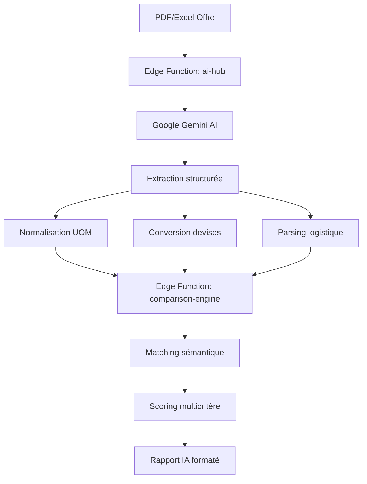

## Présentation / Overview

Le **Comparateur IA** est le moteur d'analyse central de VesselIQ. Alimenté par **Google Gemini**, il extrait automatiquement les données des documents fournisseurs (PDF, Excel), réalise un matching sémantique intelligent entre les articles demandés et proposés, et calcule un scoring multicritère objectif.

*The **AI Comparator** is VesselIQ's central analysis engine. Powered by **Google Gemini**, it automatically extracts data from supplier documents (PDF, Excel), performs intelligent semantic matching between requested and proposed items, and calculates an objective multi-criteria score.*

---

## Architecture IA / AI Architecture

---

## Étapes d'analyse / Analysis Steps

### 1. Extraction PDF / PDF Extraction

L'IA analyse le document en suivant un **prompt structuré** pour extraire :

| Donnée | Description | Confiance |
|--------|-------------|-----------|
| **Référence** article | Numéro fabricant + alternatives | Haute |
| **Désignation** | Description technique normalisée | Haute |
| **Quantité** | Nombre d'unités + UOM normalisé | Haute |
| **Prix unitaire** | Prix par unité dans la devise d'origine | Moyenne |
| **Prix total** | Montant ligne | Haute |
| **Devise** | Code ISO de la devise | Haute |
| **Fabricant** | Maker/OEM identifié | Moyenne |
| **Origine** | Pays d'origine | Basse |
| **Délai** | Lead time en jours | Moyenne |

#### Informations logistiques extraites / Extracted Logistics

- **Incoterm** et lieu d'application
- **Port/lieu de livraison**
- **Mode d'expédition** (maritime, aérien, routier)
- **Validité** de l'offre (jours)
- **Conditions de paiement** (méthode, avance, crédit)
- **Coûts logistiques** détaillés (transport, assurance, douane, etc.)
- **Poids** et informations d'emballage

### 2. Normalisation / Normalization

- **UOM** : normalisation automatique des unités de mesure (PC, SET, LOT, KG, M, L, etc.)
- **Devises** : conversion en devise de référence via taux temps réel
- **Références** : nettoyage et standardisation des numéros de pièce

### 3. Matching sémantique / Semantic Matching

Le système de matching fonctionne en **multi-passes** :

<Steps>
  <Step title="Pass 1 : Exact Match">
    Correspondance exacte sur les références article (incluant alternatives).
  </Step>
  <Step title="Pass 2 : Semantic Match">
    L'IA Gemini analyse la **similarité sémantique** entre désignations quand la référence ne matche pas directement.
  </Step>
  <Step title="Pass 3 : Kit Detection">
    Détection automatique des kits contenant plusieurs articles PDR (KIT_COMPONENT, KIT_CONTAINS).
  </Step>
  <Step title="Pass 4 : Manual Escalation">
    Les articles sans correspondance sont escaladés pour revue manuelle avec les candidats les plus proches.
  </Step>
</Steps>

### 4. Scoring / Scoring

Le **scoring engine** calcule un score global sur 100 points :

#### Note Technique (60 points max)
- Conformité articles (25) — articles conformes / total
- Caractéristiques pièces (15) — OEM, certifié, qualité
- Délai de livraison (10) — respect du délai demandé
- Certificats fournisseur (5)
- Qualité historique (5) — basée sur le rating fournisseur

#### Note Financière (40 points max)
- Montant total (20) — compétitivité prix
- Conditions paiement (10) — favorabilité des termes
- Validité offre (10) — durée suffisante

#### Flags & Observations
Pour chaque offre, le moteur génère des **observations classifiées** :
- 🔴 **Critical** — critère bloquant (paiement interdit, article manquant critique)
- 🟡 **Warning** — alerte nécessitant attention
- 🔵 **Info** — information contextuelle

---

## Avantages / Benefits

<Tip>
  L'extraction IA élimine **90% de la saisie manuelle** des données fournisseurs, réduisant drastiquement les erreurs et le temps de traitement.
  
  *AI extraction eliminates **90% of manual data entry**, drastically reducing errors and processing time.*
</Tip>

<Tip>
  Le matching sémantique identifie les correspondances même quand les fournisseurs utilisent des **références alternatives ou des désignations différentes**.
  
  *Semantic matching identifies correspondences even when suppliers use **alternative references or different designations**.*
</Tip>
