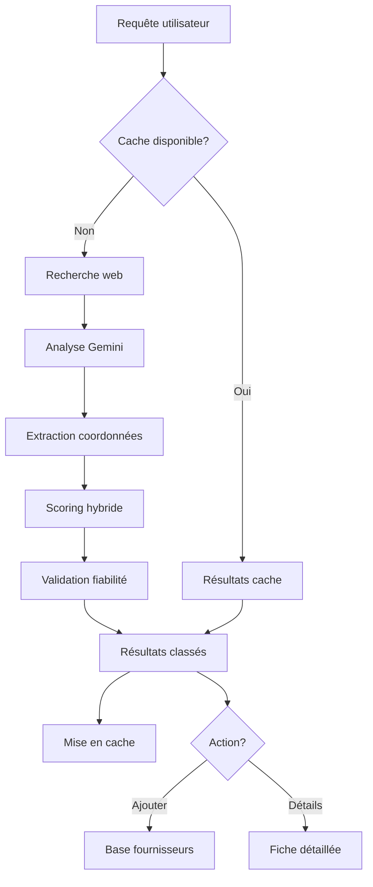

## Présentation / Overview

La **Recherche Fournisseur IA** permet de trouver de nouveaux fournisseurs sur le web en utilisant l'intelligence artificielle. À partir d'une description de besoin, l'IA recherche, analyse et classe les fournisseurs potentiels avec un scoring de pertinence.

*The **AI Supplier Search** lets you find new suppliers on the web using artificial intelligence. From a needs description, the AI searches, analyzes, and ranks potential suppliers with a relevance score.*

<Frame caption="Recherche intelligente et résultats enrichis pour l'ajout de nouveaux fournisseurs.">
  
</Frame>

---

## Fonctionnalités / Features

### 1. Recherche intelligente / Intelligent Search

<Steps>
  <Step title="Saisie de la requête / Query Input">
    Tapez une description de votre besoin en langage naturel :
    - *"Fournisseur de joints moteur Wärtsilä en Europe"*
    - *"OEM pistons MAN B\&W disponible en Asie"*
    - *"Distributeur agréé Caterpillar pièces marines"*
  </Step>
  <Step title="Analyse IA / AI Analysis">
    L'IA utilise la recherche web combinée à Gemini pour :
    - Identifier les entreprises correspondantes
    - Extraire les coordonnées (email, téléphone, site web)
    - Déterminer le type (OEM, distributeur, agent)
    - Évaluer la fiabilité et la pertinence
  </Step>
  <Step title="Résultats enrichis / Enriched Results">
    Chaque résultat affiche :
    - Nom de l'entreprise et pays
    - Score de confiance IA (0-100%)
    - Spécialisation détectée
    - Coordonnées extraites
    - Badge OEM/Agréé si applicable
    - Score hybride (pertinence + qualité contacts + confiance IA)
  </Step>
</Steps>

### 2. Score hybride / Hybrid Score

Le score final combine trois dimensions :

| Dimension | Poids | Description |
|-----------|-------|-------------|
| **Pertinence mots-clés** | 40% | Correspondance avec la requête |
| **Qualité contacts** | 30% | Disponibilité email, téléphone, site |
| **Confiance IA** | 30% | Fiabilité de la source et des données |

### 3. Ajout rapide / Quick Add

Depuis les résultats de recherche, vous pouvez :
- **Ajouter directement** un fournisseur trouvé à votre base
- **Voir les détails web** — ouvrir le site du fournisseur
- **Consulter l'analyse** — données IA détaillées

### 4. Analytics de recherche / Search Analytics

Le module de statistiques affiche :
- Historique des recherches effectuées
- Taux de conversion (recherche → ajout fournisseur)
- Sources les plus fiables
- Requêtes les plus fréquentes

### 5. Cache intelligent / Smart Cache

Les résultats de recherche sont mis en cache (IndexedDB + Supabase) pour :
- Éviter les appels API redondants
- Accélérer les recherches récurrentes
- Réduire les coûts API Gemini

---

## Logique du flux / Workflow Logic

---

## Avantages / Benefits

<Tip>
  La recherche IA trouve des fournisseurs **spécialisés dans le maritime** que les moteurs de recherche classiques ne ciblent pas aussi efficacement.
  
  *AI search finds suppliers **specialized in maritime** that traditional search engines don't target as effectively.*
</Tip>

---

## Dépannage / Troubleshooting

<AccordionGroup>
  <Accordion title="Résultats peu pertinents / Irrelevant results">
    Soyez plus spécifique dans votre requête : incluez la marque, le type de pièce, et la zone géographique souhaitée.
    
    *Be more specific in your query: include brand, part type, and desired geographic area.*
  </Accordion>
  <Accordion title="Erreur 429 (rate limit) / Rate limit error">
    L'API Gemini a des limitations de débit. Attendez quelques secondes avant de relancer la recherche. Le système de queue gère automatiquement les retries.
    
    *The Gemini API has rate limits. Wait a few seconds before retrying. The queue system auto-manages retries.*
  </Accordion>
</AccordionGroup>
