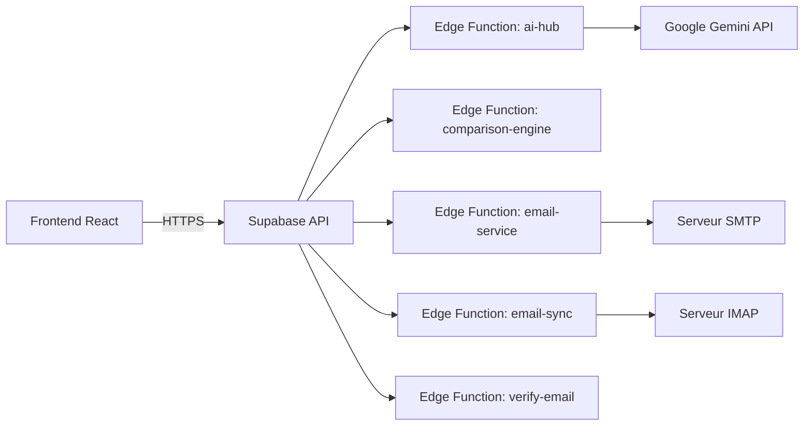

## Présentation / Overview

VesselIQ utilise **5 Edge Functions Supabase** (runtime Deno) pour les traitements backend gourmands en ressources : analyse IA, moteur de comparaison, envoi/réception d'emails, et vérification d'emails.

*VesselIQ uses **5 Supabase Edge Functions** (Deno runtime) for resource-intensive backend processing: AI analysis, comparison engine, email sending/receiving, and email verification.*

---

## Fonctions disponibles / Available Functions

### 1. `ai-hub`

Le point d'entrée principal pour toutes les opérations IA :

| Action | Description |
|--------|-------------|
| `extract` | Extraction des données d'un PDF/document fournisseur |
| `enrich` | Enrichissement des données fournisseur |
| `compare` | Comparaison IA entre PDR et offre |
| `normalize` | Normalisation des descriptions techniques |
| `search` | Recherche intelligente de fournisseurs web |
| `analyze` | Analyse de conformité LC |
| `chat` | Assistant chatbot contextuel |

**Sécurité** : Token JWT Supabase requis, rate limiting intégré, retry automatique sur erreur 429.

### 2. `comparison-engine`

Moteur de comparaison multicritère dédié :
- Reçoit les données PDR et les données d'offres
- Effectue le matching sémantique article par article
- Calcule les scores techniques et financiers
- Détecte les anomalies et discrepancies
- Retourne un rapport structuré JSON

### 3. `email-service`

Service d'envoi d'emails via SMTP :
- Envoi unitaire ou en masse (bulk)
- Support des pièces jointes
- Templates avec variables
- Rapport de livraison (succès/échec par destinataire)

### 4. `email-sync`

Synchronisation des emails reçus via IMAP :
- Connexion au serveur IMAP du client
- Récupération des nouveaux emails
- Stockage des emails et pièces jointes dans Supabase
- Association automatique avec les consultations

### 5. `verify-email`

Vérification de la validité des adresses email :
- Vérification de syntaxe
- Vérification DNS du domaine
- Vérification de l'existence de la boîte mail

---

## Architecture de déploiement / Deployment Architecture



---

## Déploiement / Deployment

```bash
# Déployer toutes les fonctions / Deploy all functions
npx supabase functions deploy ai-hub
npx supabase functions deploy comparison-engine
npx supabase functions deploy email-service
npx supabase functions deploy email-sync
npx supabase functions deploy verify-email
```

---

## Variables d'environnement / Environment Variables

| Variable | Fonction | Description |
|----------|----------|-------------|
| `GEMINI_API_KEY` | ai-hub | Clé API Google Gemini |
| `SMTP_HOST` | email-service | Serveur SMTP |
| `SMTP_PORT` | email-service | Port SMTP |
| `SMTP_USER` | email-service | Utilisateur SMTP |
| `SMTP_PASS` | email-service | Mot de passe SMTP |
| `IMAP_HOST` | email-sync | Serveur IMAP |
| `IMAP_PORT` | email-sync | Port IMAP |
