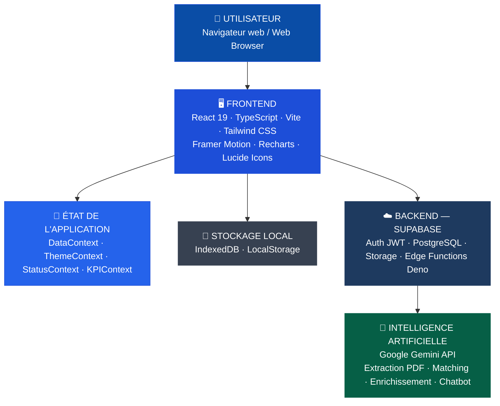

## Vue d'ensemble / Overview

VesselIQ est une application web moderne construite avec une architecture **monolithique frontend** connectée à un backend **Supabase** (BaaS). L'intelligence artificielle est fournie par **Google Gemini** via des Edge Functions serverless.

*VesselIQ is a modern web application built with a **frontend monolith** architecture connected to a **Supabase** backend (BaaS). Artificial intelligence is powered by **Google Gemini** via serverless Edge Functions.*

---

## Architecture globale / Global Architecture

Le schéma présente les 5 couches de l'architecture VesselIQ, de l'interface utilisateur aux services cloud.

*The diagram shows VesselIQ's 5 architecture layers, from the user interface to cloud services.*

---

## Technologies Frontend

| Technologie | Version | Usage |
|---|---|---|
| **React** | 19 | Framework UI, composants fonctionnels, hooks |
| **TypeScript** | 5+ | Typage statique, interfaces, types union |
| **Vite** | 6+ | Bundler, HMR, build optimisé |
| **Tailwind CSS** | 4+ | Styling utility-first, dark mode |
| **Framer Motion** | 11+ | Animations, transitions, gestures |
| **Recharts** | 2+ | Graphiques (barres, lignes, donuts, radar) |
| **Lucide React** | - | Icônes vectorielles |
| **XLSX** | - | Lecture/écriture fichiers Excel |
| **Docxtemplater** | - | Génération documents Word |
| **date-fns** | - | Manipulation de dates |

## Technologies Backend

| Technologie | Usage |
|---|---|
| **Supabase** | Auth, Database (PostgreSQL), Storage, Edge Functions |
| **Deno** | Runtime pour les Edge Functions |
| **Prisma** | ORM pour accès base de données |
| **IMAP/SMTP** | Protocoles email (Node.js backend) |

## Intelligence Artificielle

| Technologie | Usage |
|---|---|
| **Google Gemini** | Extraction PDF, matching sémantique, recherche web, chatbot |
| **Prompts structurés** | Instructions détaillées pour chaque type d'analyse |

---

## Gestion d'état / State Management

VesselIQ utilise la **React Context API** (pas de Redux) :

| Context | Responsabilité |
|---------|---------------|
| `DataContext` | Données globales (consultations, fournisseurs, navires, BC) |
| `ThemeContext` | Mode sombre/clair |
| `StatusContext` | Messages de statut et notifications |
| `KPIContext` | Cache des données KPI calculées |

---

## Stockage local / Local Storage

Deux niveaux de persistance locale :
- **IndexedDB** — stockage structuré pour les données volumineuses (consultations, offres)
- **LocalStorage** — préférences utilisateur, cache léger

Le module `indexedDB.ts` gère la synchronisation avec Supabase.

---

## Conventions de code / Code Conventions

- **Composants** : PascalCase, `.tsx` (ex: `OfferComparison.tsx`)
- **Services** : camelCase, `.ts` (ex: `comparisonService.ts`)
- **Hooks** : `use` prefix (ex: `useConsultationFilters.ts`)
- **Types** : interfaces TypeScript dans `types.ts` et `types/`
- **Styles** : Tailwind CSS utility classes, pas de CSS modules
