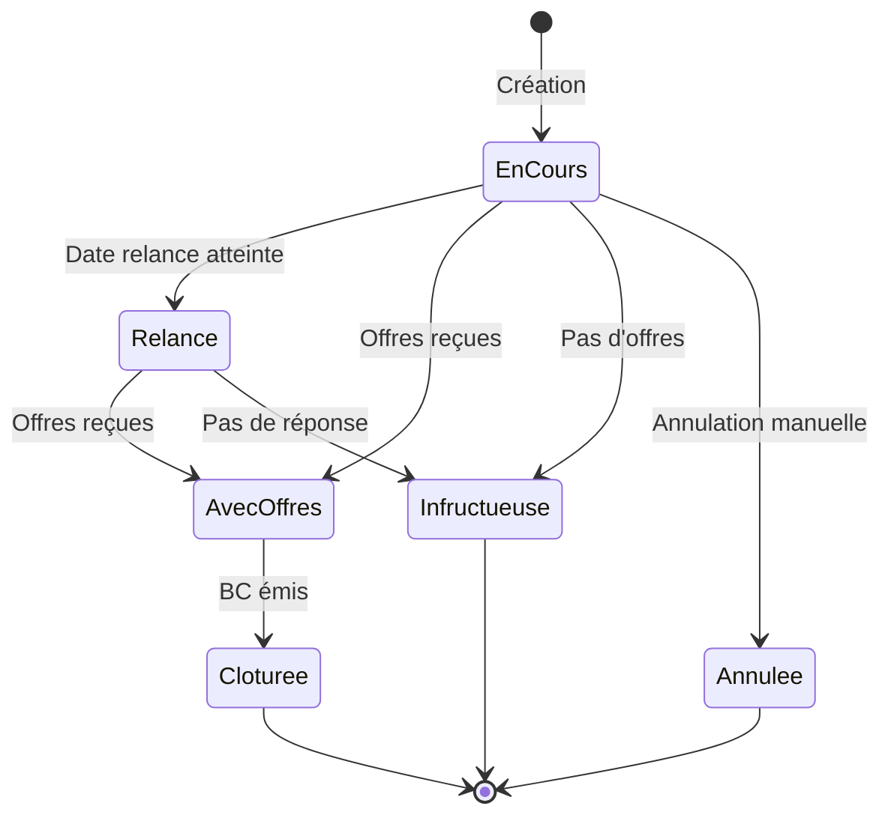
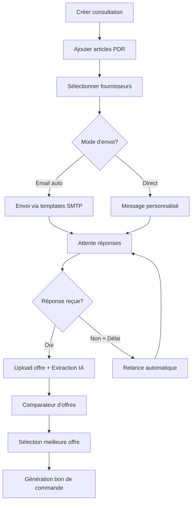

## Présentation / Overview

Le module **Consultations** est le cœur de VesselIQ. Il gère l'intégralité du processus d'achat maritime : de la création d'une demande de pièces jusqu'à la réception des offres fournisseurs. Chaque consultation suit un cycle de vie strict et génère automatiquement les références de suivi.

*The **Consultations** module is the core of VesselIQ. It manages the entire maritime procurement process — from creating parts requests to receiving supplier offers. Each consultation follows a strict lifecycle and auto-generates tracking references.*

---

## Cycle de vie / Lifecycle

| Statut | Description FR | Description EN |
|--------|---------------|----------------|
| **En cours** | Consultation active, en attente de réponses | Active, awaiting responses |
| **Relance** | Rappels envoyés aux fournisseurs | Reminders sent to suppliers |
| **Avec Offres** | Au moins une offre reçue | At least one offer received |
| **Infructueuse** | Aucune offre reçue après relance | No offers received after reminder |
| **Annulée** | Consultation annulée manuellement | Manually cancelled |
| **Clôturée** | Bon de commande émis | Purchase order issued |

---

## Fonctionnalités / Features

### 1. Nouvelle Consultation / New Consultation

<Steps>
  <Step title="Configuration de base / Basic Configuration">
    Renseignez les informations essentielles :
    - **Désignation** — description de la demande (ex: "Pièces de rechange moteur principal")
    - **Navire** — sélection du navire concerné depuis la base navires
    - **Client** — nom du donneur d'ordre
    - **Référence** — générée automatiquement au format `{NNN}CN-{AA}-R{X}` (ex: `001CN-26-R0`)
    - **Date limite de dépôt** — date butoir pour les fournisseurs
    - **Date de relance** — date de rappel automatique

    *Fill in essential information: designation, vessel, client, auto-generated reference, deadline, and reminder date.*
  </Step>
  <Step title="Liste des pièces (PDR - Pièces de Rechange) / Parts List">
    Ajoutez les articles demandés avec :
    - **Référence** pièce (numéro constructeur)
    - **Désignation** technique
    - **Quantité** et **unité de mesure** (UOM)
    - **Prix estimé** (optionnel)
    - **Pièce critique** : marquez les articles essentiels

    <Tip>
      Vous pouvez **importer un fichier Excel** pour charger automatiquement la liste des pièces grâce au module d'import intelligent.
      
      *You can **import an Excel file** to automatically load the parts list via the smart import module.*
    </Tip>
  </Step>
  <Step title="Sélection des fournisseurs / Supplier Selection">
    Choisissez les fournisseurs à consulter :
    - Recherche par nom, pays, spécialité
    - Filtrage par groupe fournisseur
    - Sélection par catégorie ou marque
    - Ajout rapide depuis les favoris

    Chaque fournisseur sélectionné reçoit un statut initial **"En attente"**.
    
    *Each selected supplier starts with an **"Awaiting"** status.*
  </Step>
  <Step title="Envoi de la consultation / Send Consultation">
    Deux modes d'envoi :
    - **Via email automatique** — utilise les templates configurés et envoie directement via SMTP
    - **Consultation directe** — envoi d'un message personnalisé avec pièces jointes

    *Two sending modes: automatic email via templates or direct consultation with custom message.*
  </Step>
</Steps>

### 2. Historique des Consultations / Consultation History

<AccordionGroup>
  <Accordion title="Vue tableau / Table View">
    Tableau complet avec colonnes redimensionnables :
    - Référence, objet, navire, client
    - Statut (avec badge couleur)
    - Nombre de fournisseurs consultés
    - Nombre d'offres reçues
    - Dates (création, relance, limite)
    
    *Complete table with resizable columns: reference, subject, vessel, client, status, supplier count, offer count, dates.*
  </Accordion>
  <Accordion title="Filtres avancés / Advanced Filters">
    Filtrez par :
    - **Statut** du cycle de vie
    - **Navire** concerné
    - **Période** (date de création)
    - **Client** donneur d'ordre
    - **Recherche texte** dans la désignation/référence

    *Filter by lifecycle status, vessel, period, client, and text search.*
  </Accordion>
  <Accordion title="Statistiques / Statistics">
    Bandeau en haut affichant :
    - Total consultations
    - Répartition par statut
    - Taux de réponse global
    - Budget total engagé

    *Top banner showing: total consultations, status distribution, response rate, total committed budget.*
  </Accordion>
  <Accordion title="Panneau de détails / Detail Panel">
    Cliquez sur une consultation pour ouvrir un panneau latéral avec :
    - Informations complètes
    - Liste des fournisseurs consultés avec statuts
    - Offres reçues et montants
    - Actions rapides (relancer, clôturer, annuler)
    - Accès direct au comparateur d'offres

    *Click on a consultation to open a side panel with: full info, supplier list with statuses, offers, quick actions, and direct link to offer comparison.*
  </Accordion>
</AccordionGroup>

### 3. Réponses fournisseurs / Supplier Responses

Chaque fournisseur consulté peut avoir les statuts suivants :

| Statut | Icône | Description |
|--------|-------|-------------|
| **En attente** | ⏳ | Pas encore de réponse |
| **Offre reçue** | 📩 | Offre PDF/document reçu |
| **Accepté** | ✅ | Offre retenue pour BC |
| **Refusé** | ❌ | Offre non retenue |
| **Éliminé** | 🚫 | Fournisseur éliminé |
| **Négociation** | 🤝 | En cours de négociation |
| **Pas d'offre** | ➖ | Fournisseur n'a pas soumis |

Pour chaque réponse reçue, vous pouvez :
- **Uploader le fichier d'offre** (PDF, Excel)
- **Lancer l'extraction IA** pour analyser automatiquement le contenu
- **Saisir manuellement** le montant, la devise, les conditions
- **Visualiser les données extraites** par l'IA

*For each received response, you can: upload the offer file, launch AI extraction, manually enter amount/currency/conditions, or view AI-extracted data.*

---

## Logique du flux de travail / Workflow Logic

### Dépendances / Dependencies

- **Fournisseurs** : la base fournisseurs doit contenir des fournisseurs avec emails valides
- **Navires** : un navire doit être sélectionné pour chaque consultation
- **Templates email** : les templates doivent être configurés dans la messagerie
- **IA Gemini** : l'extraction automatique nécessite une clé API Gemini valide

*Dependencies: suppliers with valid emails, vessel selection, email templates, valid Gemini API key.*

---

## Avantages / Benefits

<Tip>
  Le système de **référencement automatique** (`{NNN}CN-{AA}-R{X}`) garantit une traçabilité complète et évite les doublons de référence.
  
  *The **automatic referencing** system ensures complete traceability and prevents duplicate references.*
</Tip>

<Tip>
  L'**extraction IA** des PDFs fournisseurs élimine la saisie manuelle des articles et prix, réduisant les erreurs de 90%.
  
  ***AI extraction** from supplier PDFs eliminates manual data entry, reducing errors by 90%.*
</Tip>

---

## Dépannage / Troubleshooting

<AccordionGroup>
  <Accordion title="L'envoi d'email échoue / Email sending fails">
    Vérifiez la configuration SMTP dans l'onglet Messagerie > Paramètres. Assurez-vous que le serveur SMTP, le port, et les identifiants sont corrects.
    
    *Check SMTP configuration in Email > Settings. Ensure the SMTP server, port, and credentials are correct.*
  </Accordion>
  <Accordion title="L'extraction IA ne fonctionne pas / AI extraction not working">
    Vérifiez votre clé API Gemini dans `.env.local`. Assurez-vous que le fichier est bien un PDF lisible (pas un scan image sans OCR).
    
    *Check your Gemini API key in `.env.local`. Make sure the file is a readable PDF (not an image scan without OCR).*
  </Accordion>
  <Accordion title="La référence n'est pas générée / Reference not generated">
    Les références sont auto-générées à partir du compteur global. Si le problème persiste, vérifiez la connexion à la base de données Supabase.
    
    *References are auto-generated from the global counter. If the issue persists, check the Supabase database connection.*
  </Accordion>
</AccordionGroup>
