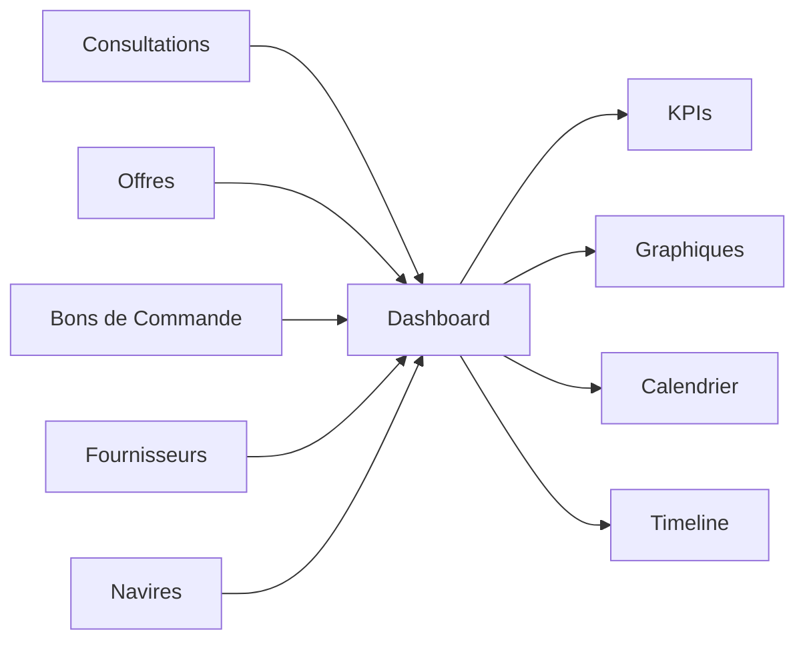

## Présentation / Overview

Le **Tableau de Bord** est la page d'accueil de VesselIQ. Il offre une vue synthétique et en temps réel de toute l'activité d'approvisionnement : consultations en cours, budgets, performances fournisseurs et échéances critiques.

*The **Dashboard** is VesselIQ's home page. It provides a real-time summary of all procurement activity: ongoing consultations, budgets, supplier performance, and critical deadlines.*

<Frame caption="Aperçu du tableau de bord principal avec les statistiques et l'activité récente.">
  
</Frame>

---

## Fonctionnalités / Features

### 1. Cartes de statistiques / Stats Cards

<Steps>
  <Step title="Consultations actives / Active Consultations">
    Affiche le nombre total de consultations en cours avec leur tendance (hausse/baisse).
    
    *Shows the total number of active consultations with their trend (up/down).*
  </Step>
  <Step title="Offres reçues / Received Offers">
    Nombre d'offres fournisseurs reçues sur la période sélectionnée.
    
    *Number of supplier offers received during the selected period.*
  </Step>
  <Step title="Budget engagé / Committed Budget">
    Montant total des bons de commande émis, avec comparaison période précédente.
    
    *Total amount of issued purchase orders, with previous period comparison.*
  </Step>
  <Step title="Taux de réponse / Response Rate">
    Pourcentage de fournisseurs ayant répondu aux consultations.
    
    *Percentage of suppliers who responded to consultations.*
  </Step>
</Steps>

### 2. Jauges de performance KPI / KPI Performance Gauges

Les **jauges circulaires** affichent les indicateurs clés :
- **Taux OTD** (On-Time Delivery) — pourcentage de livraisons à temps
- **Taux de conformité** — conformité des pièces reçues
- **Score fournisseurs** — note moyenne des fournisseurs actifs

*The **circular gauges** display key indicators: OTD rate, compliance rate, and average supplier score.*

### 3. Graphiques analytiques / Analytical Charts

<AccordionGroup>
  <Accordion title="Répartition par statut / Status Distribution">
    Graphique en donut montrant la répartition des consultations par statut : En cours, Avec Offres, Clôturée, Annulée, Infructueuse.
    
    *Donut chart showing consultation distribution by status: Active, With Offers, Closed, Cancelled, Unsuccessful.*
  </Accordion>
  <Accordion title="Évolution budgétaire / Budget Evolution">
    Graphique en barres/lignes montrant l'évolution des dépenses par mois avec les tendances.
    
    *Bar/line chart showing monthly spending evolution with trends.*
  </Accordion>
  <Accordion title="Analyse fournisseurs / Supplier Analysis">
    Top fournisseurs par volume, performance, et délai moyen de réponse.
    
    *Top suppliers by volume, performance, and average response time.*
  </Accordion>
</AccordionGroup>

### 4. Calendrier des échéances / Deadline Calendar

Le calendrier identifie visuellement les dates critiques :
- 🟡 **Dates limites de dépôt** des consultations
- 🔴 **Dates de relance** programmées
- 🟢 **Dates de livraison** attendues

*The calendar visually identifies critical dates: consultation deadlines, scheduled reminders, and expected delivery dates.*

### 5. Timeline d'activité / Activity Timeline

Flux chronologique des dernières actions :
- Nouvelles consultations créées
- Offres reçues et analysées
- Bons de commande émis
- Emails envoyés/reçus

*Chronological feed of recent actions: new consultations, received offers, issued POs, sent/received emails.*

---

## Logique du flux de travail / Workflow Logic

Le dashboard agrège les données de **tous les modules** en temps réel :

Les données sont récupérées depuis le **DataContext** (React Context API), qui centralise l'état de l'application.

*Data is fetched from the **DataContext** (React Context API), which centralizes the application state.*

---

## Avantages / Benefits

<Tip>
  Le tableau de bord vous permet de **détecter immédiatement** les retards, les consultations sans réponse et les échéances imminentes, réduisant les risques d'oubli.
  
  *The dashboard lets you **immediately detect** delays, unanswered consultations, and upcoming deadlines, reducing oversight risks.*
</Tip>

---

## Dépannage / Troubleshooting

<AccordionGroup>
  <Accordion title="Les données ne s'affichent pas / Data not displaying">
    Vérifiez la connexion Supabase dans vos variables d'environnement. Rafraîchissez la page ou vérifiez la console navigateur pour des erreurs réseau.
    
    *Check the Supabase connection in your environment variables. Refresh the page or check the browser console for network errors.*
  </Accordion>
  <Accordion title="Les KPIs affichent 0% / KPIs showing 0%">
    Les KPIs nécessitent des données de consultations et de bons de commande. Créez d'abord quelques consultations test.
    
    *KPIs require consultation and purchase order data. Create some test consultations first.*
  </Accordion>
</AccordionGroup>
