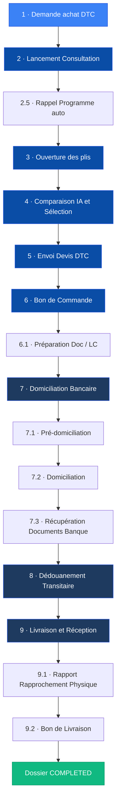

> **FR** — Suivez en temps réel chaque étape du cycle d'approvisionnement depuis la **demande d'achat** jusqu'à la **livraison et réception** des pièces à bord.
>
> **EN** — Track in real-time every step of the procurement cycle from the **purchase request** to the **delivery and on-board reception** of parts.

<Note>
Le suivi est **automatiquement initialisé** dès qu'une consultation est créée dans VesselIQ. Il n'est pas nécessaire d'attendre le bon de commande pour démarrer un dossier.

*Tracking is **automatically initialized** as soon as a consultation is created in VesselIQ — no need to wait for a purchase order.*
</Note>

---

## Présentation / Overview

Le module **Suivi des Dossiers** implémente un workflow séquentiel de 9 étapes principales (avec sous-étapes) couvrant l'intégralité du cycle d'approvisionnement maritime.

*The **Dossier Tracking** module implements a sequential workflow of 9 main steps (with sub-steps) covering the entire maritime procurement cycle.*

<Frame caption="Vue de la progression du dossier logistique : étapes complétées, en cours et futures.">
  
</Frame>

<Frame caption="Détail d'une étape spécifique avec les actions requises (domiciliation, douanes).">
  
</Frame>

<Frame caption="Phases finales du suivi : transit, livraison au navire et clôture du dossier.">
  
</Frame>

---

## Workflow complet / Full Workflow

Le workflow est défini dans `types/tracking.ts` et `services/trackingService.ts`. Voici les étapes exactes telles qu'implémentées dans le code source :

*The workflow is defined in `types/tracking.ts` and `services/trackingService.ts`. Here are the exact steps as implemented in the source code:*

<Steps>
  <Step title="1 — Demande d'achat (DTC)">
    **FR** — Origine du besoin. La DTC (Demande de Travaux / Commande) est créée par le service demandeur (pont, machine, etc.). C'est le point de départ officiel du dossier.

    **EN** — The DTC (purchase/work request) is created by the requesting department (bridge, engine room, etc.). This is the official starting point of the dossier.

    - Type : Étape **manuelle** — `isAutomated: false`
    - ID interne : `DEMANDE_ACHAT` (step `"1"`)
  </Step>

  <Step title="2 — Lancement Consultation">
    **FR** — La consultation fournisseurs est officiellement lancée dans VesselIQ. Les fournisseurs ciblés sont notifiés par email. Cette étape est **automatiquement marquée** dès que la consultation passe en statut « Active ».

    **EN** — The supplier consultation is officially launched in VesselIQ. Targeted suppliers are notified by email. This step is **automatically marked** as soon as the consultation becomes « Active ».

    - Type : Étape **automatisée** — `isAutomated: true`
    - ID interne : `LANCEMENT_CONSULTATION` (step `"2"`)
    - Sous-étape automatique : Rappel Programme (`"2.5"`) — relance avant deadline
  </Step>

  <Step title="3 — Ouverture des plis">
    **FR** — Les offres fournisseurs sont dépouillées. Le module Consultations agrège toutes les réponses reçues. Cette étape est déclenchée automatiquement quand la consultation passe en « Avec Offres ».

    **EN** — Supplier offers are opened and aggregated. The Consultations module collects all received responses. This step is triggered automatically when the consultation moves to « With Offers ».

    - Type : Étape **automatisée** — `isAutomated: true`
    - ID interne : `OUVERTURE_PLIS` (step `"3"`)
  </Step>

  <Step title="4 — Comparaison IA & Sélection">
    **FR** — Le Comparateur IA analyse et classe les offres. L'acheteur valide la sélection du fournisseur. Cette étape est automatiquement activée à l'ouverture du comparateur.

    **EN** — The AI Comparator analyzes and ranks offers. The buyer validates the supplier selection. This step is automatically activated when the comparator is opened.

    - Type : Étape **automatisée** — `isAutomated: true`
    - ID interne : `COMPARAISON_SELECTION` (step `"4"`)
    - Métadonnées enregistrées : `selectedSupplierId`, `supplierName`, `aiScore`
  </Step>

  <Step title="5 — Envoi Devis DTC">
    **FR** — Le devis retenu est transmis au demandeur (DTC) pour validation interne avant engagement de commande.

    **EN** — The selected quote is sent to the requester (DTC) for internal validation before order commitment.

    - Type : Étape **automatisée** — `isAutomated: true`
    - ID interne : `ENVOI_DEVIS_DTC` (step `"5"`)
  </Step>

  <Step title="6 — Bon de Commande (+ sous-étapes)">
    **FR** — Le bon de commande est émis via VesselIQ et transmis au fournisseur. Une sous-étape gère la préparation documentaire pour la LC.

    **EN** — The purchase order is issued through VesselIQ and sent to the supplier. A sub-step handles documentary preparation for the LC.

    - Type : Étape **automatisée** — `isAutomated: true`
    - ID interne : `BON_COMMANDE` (step `"6"`)
    - Métadonnées : `poNumber`, `poAmount`

    **Sous-étape :**
    | ID | Label | Type |
    |----|-------|------|
    | `6.1` | Prép. Remise Doc / LC | Manuelle |
  </Step>

  <Step title="7 — Domiciliation Bancaire (+ sous-étapes)">
    **FR** — Procédure réglementaire algérienne. La déclaration d'importation est enregistrée auprès de la banque domiciliatrice. Comprend 3 sous-étapes.

    **EN** — Algerian regulatory requirement. The import declaration is registered with the domiciliary bank. Includes 3 sub-steps.

    - Type : Étape **manuelle** — `isAutomated: false`
    - ID interne : `DOMICILIATION_BANCAIRE` (step `"7"`)
    - Métadonnées : `bankReference`

    **Sous-étapes :**
    | ID | Label | Type |
    |----|-------|------|
    | `7.1` | Pré-domiciliation | Manuelle |
    | `7.2` | Domiciliation | Manuelle |
    | `7.3` | Récupération Documents Banque | Manuelle |
  </Step>

  <Step title="8 — Dédouanement Transitaire">
    **FR** — Le transitaire prend en charge la marchandise. Les déclarations douanières sont déposées et les droits payés.

    **EN** — The freight forwarder handles the goods. Customs declarations are filed and duties paid.

    - Type : Étape **manuelle** — `isAutomated: false`
    - ID interne : `DEDOUANEMENT` (step `"8"`)
    - Métadonnées : `transitaireName`, `customsReference`
  </Step>

  <Step title="9 — Livraison & Réception (+ sous-étapes)">
    **FR** — La marchandise est livrée à bord ou en magasin. Un rapprochement physique est effectué et un bon de livraison est signé.

    **EN** — Goods are delivered on board or to the warehouse. A physical verification is performed and a delivery note is signed.

    - Type : Étape **manuelle** — `isAutomated: false`
    - ID interne : `LIVRAISON_RECEPTION` (step `"9"`)

    **Sous-étapes :**
    | ID | Label | Type |
    |----|-------|------|
    | `9.1` | Rapport Rapprochement Physique | Manuelle |
    | `9.2` | Bon de Livraison | Manuelle |
  </Step>
</Steps>

---

## Logique du flux / Workflow Logic

### Statuts de dossier / Dossier Statuses

| Statut | Couleur | Description FR | Description EN |
|--------|---------|----------------|----------------|
| `on_track` | 🟢 Vert | Dans les délais | On schedule |
| `delayed` | 🟡 Orange | Dépassement de délai détecté | Delay detected |
| `blocked` | 🔴 Rouge | Étape bloquante active | Active blocking step |
| `completed` | ✅ Vert | Dossier clôturé | Dossier closed |

### Statuts d'étape / Step Statuses

| Statut | Icône | Description |
|--------|-------|-------------|
| `pending` | ⬜ | En attente / Pending |
| `in_progress` | 🔵 | En cours / In progress |
| `completed` | ✅ | Terminé / Completed |
| `error` | ❌ | Erreur / Error |
| `skipped` | ⏭️ | Ignorée / Skipped |

---

## Fonctionnalités / Features

<AccordionGroup>
  <Accordion title="Progression automatique / Auto-progression">
    **FR** — VesselIQ surveille l'état des consultations et met à jour automatiquement les étapes 2, 3, 4, 5 et 6 lorsque les actions correspondantes sont effectuées dans l'application (consultation lancée, offres reçues, comparateur utilisé, BC émis).

    **EN** — VesselIQ monitors consultation state and auto-updates steps 2, 3, 4, 5 and 6 when corresponding actions are performed in the app (consultation launched, offers received, comparator used, PO issued).
  </Accordion>

  <Accordion title="Journal d'audit / Audit Log">
    **FR** — Chaque modification d'étape est enregistrée dans un journal d'audit horodaté (`AuditLogEntry`). Types d'événements : `step_updated`, `status_changed`, `dossier_created`, `sync_performed`.

    **EN** — Every step modification is recorded in a timestamped audit log (`AuditLogEntry`). Event types: `step_updated`, `status_changed`, `dossier_created`, `sync_performed`.
  </Accordion>

  <Accordion title="Alertes intelligentes / Smart Alerts">
    **FR** — Le système génère des alertes (`DossierAlert`) lorsqu'une étape est en retard ou bloquée, permettant une action corrective immédiate.

    **EN** — The system generates alerts (`DossierAlert`) when a step is delayed or blocked, enabling immediate corrective action.
  </Accordion>

  <Accordion title="Métadonnées enrichies / Rich Metadata">
    **FR** — Chaque étape peut stocker des métadonnées spécifiques : identifiant fournisseur sélectionné, numéro et montant du BC, nom du transitaire, référence bancaire, référence douanière.

    **EN** — Each step can store specific metadata: selected supplier ID, PO number and amount, freight forwarder name, bank reference, customs reference.
  </Accordion>

  <Accordion title="Persistance Supabase / Supabase Persistence">
    **FR** — Les dossiers sont persistés dans la table `dossiers` de Supabase. La méthode `getOrInitDossier()` crée automatiquement un dossier à la première consultation.

    **EN** — Dossiers are persisted in Supabase's `dossiers` table. The `getOrInitDossier()` method automatically creates a dossier on first consultation access.
  </Accordion>
</AccordionGroup>

---

## Avantages / Benefits

<Tip>
**Visibilité 360°** — Chaque acteur (acheteur, DTC, comptabilité, transitaire) peut consulter l'avancement réel du dossier en temps réel.

*360° visibility — Every stakeholder can consult the real-time progress of the dossier.*
</Tip>

<Tip>
**Traçabilité totale** — L'audit log garantit une traçabilité complète pour les audits internes et réglementaires.

*Total traceability — The audit log guarantees complete traceability for internal and regulatory audits.*
</Tip>

---

## Dépannage / Troubleshooting

<AccordionGroup>
  <Accordion title="Le dossier n'apparaît pas / Dossier not showing">
    **FR** — Vérifiez que la consultation associée existe bien dans Supabase. Le dossier est créé automatiquement au premier accès au module. Si le problème persiste, vérifiez les logs RLS de la table `dossiers`.

    **EN** — Verify that the associated consultation exists in Supabase. The dossier is auto-created on first module access. If the issue persists, check the RLS logs for the `dossiers` table.
  </Accordion>

  <Accordion title="Étape bloquée à 'pending' / Step stuck at pending">
    **FR** — Les étapes automatisées (2, 3, 4, 5, 6) nécessitent que l'action correspondante soit effectuée dans l'application. Vérifiez que la consultation a bien été lancée et que des offres ont été reçues.

    **EN** — Automated steps (2, 3, 4, 5, 6) require the corresponding action to be performed in the app. Verify that the consultation has been launched and offers received.
  </Accordion>
</AccordionGroup>
