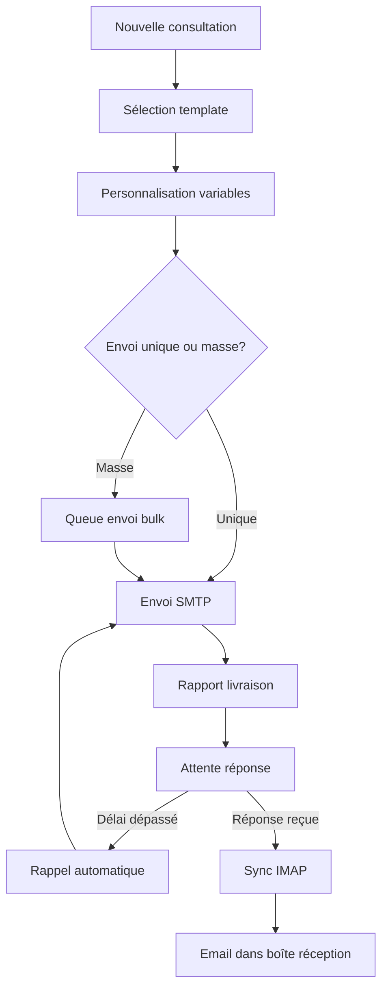

## Présentation / Overview

La **Messagerie** VesselIQ est un client email professionnel intégré, spécialement conçu pour les échanges fournisseurs maritime. Elle permet d'envoyer et recevoir des emails directement depuis l'application, avec templates personnalisables, envoi en masse, et rappels automatiques.

*VesselIQ's **Messaging** is an integrated professional email client, specifically designed for maritime supplier communications. It allows sending and receiving emails directly from the app, with customizable templates, bulk sending, and automatic reminders.*

---

## Fonctionnalités / Features

### 1. Configuration IMAP/SMTP / IMAP/SMTP Setup

<Steps>
  <Step title="Serveur IMAP (réception)">
    Configurez la réception d'emails : serveur, port (993 SSL), identifiants.
    
    *Configure email reception: server, port (993 SSL), credentials.*
  </Step>
  <Step title="Serveur SMTP (envoi)">
    Configurez l'envoi d'emails : serveur, port (465 SSL ou 587 TLS), identifiants.
    
    *Configure email sending: server, port (465 SSL or 587 TLS), credentials.*
  </Step>
  <Step title="Test de connexion">
    Testez la connexion pour vérifier les paramètres avant utilisation.
    
    *Test the connection to verify settings before use.*
  </Step>
</Steps>

### 2. Templates d'email / Email Templates

Créez et gérez des modèles d'email réutilisables :
- **Template consultation** — envoi de consultations aux fournisseurs
- **Template relance** — rappels de réponse
- **Template acceptation** — notification d'offre acceptée
- **Template rejet** — notification d'offre rejetée

#### Variables disponibles / Available Variables

| Variable | Description |
|----------|-------------|
| `{{REFERENCE}}` | Référence consultation |
| `{{FOURNISSEUR}}` | Nom du fournisseur |
| `{{DESIGNATION}}` | Désignation de la consultation |
| `{{NAVIRE}}` | Nom du navire |
| `{{CLIENT}}` | Client donneur d'ordre |
| `{{DATE_LIMITE}}` | Date limite de dépôt |
| `{{DATE_RELANCE}}` | Date de relance |
| `{{MONTANT}}` | Montant de l'offre/BC |

### 3. Envoi en masse / Bulk Email Sending

Envoyez le même email à plusieurs fournisseurs :
- Sélection depuis la liste de fournisseurs d'une consultation
- Personnalisation automatique avec les variables
- Rapport de livraison détaillé (envoyé, échoué, en attente)

*Send the same email to multiple suppliers: select from consultation supplier list, auto-personalization with variables, detailed delivery report.*

### 4. Boîte de réception / Inbox

- Synchronisation IMAP des emails reçus
- Vue en threads/conversations
- Filtrage par fournisseur ou consultation
- Pièces jointes accessibles directement

### 5. Rappels automatiques / Automatic Reminders

Le système de rappels envoie automatiquement des relances :
- Configurable par consultation
- Délai avant relance paramétrable
- Maximum de relances configurable
- Historique des rappels envoyés

---

## Logique du flux / Workflow Logic

---

## Avantages / Benefits

<Tip>
  Les **templates avec variables** garantissent des communications professionnelles et cohérentes avec tous vos fournisseurs.
  
  ***Templates with variables** ensure professional and consistent communications with all your suppliers.*
</Tip>

---

## Dépannage / Troubleshooting

<AccordionGroup>
  <Accordion title="Les emails ne sont pas reçus / Emails not being received">
    Vérifiez les paramètres IMAP. Certains serveurs nécessitent un mot de passe d'application spécifique (Gmail, Outlook).
    
    *Check IMAP settings. Some servers require a specific app password (Gmail, Outlook).*
  </Accordion>
  <Accordion title="Timeout de connexion / Connection timeout">
    Les connexions IMAP peuvent échouer en raison de pare-feu. Vérifiez que les ports 993 (IMAP) et 465/587 (SMTP) sont ouverts.
    
    *IMAP connections may fail due to firewalls. Verify ports 993 (IMAP) and 465/587 (SMTP) are open.*
  </Accordion>
</AccordionGroup>
