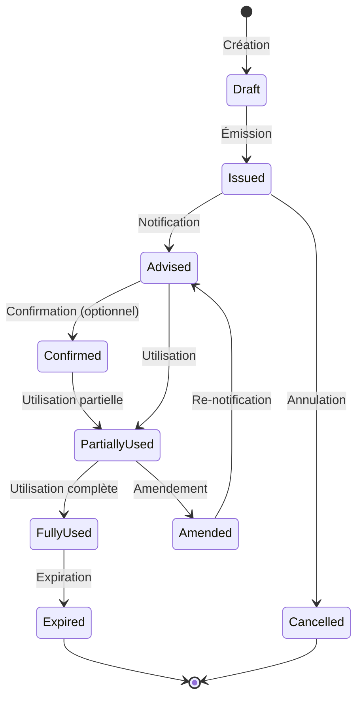

## Présentation / Overview

Le module **Lettres de Crédit** (LC) de VesselIQ est un outil complet pour créer, gérer et suivre les crédits documentaires dans le cadre du commerce maritime international. Il intègre la conformité **UCP 600** (Règles et Usances Uniformes de la CCI), un assistant IA, et la génération de messages **SWIFT MT700**.

*The **Letters of Credit** module is a comprehensive tool for creating, managing, and tracking documentary credits in international maritime trade. It integrates **UCP 600** compliance (ICC Uniform Customs and Practice), an AI assistant, and **SWIFT MT700** message generation.*

---

## Fonctionnalités / Features

### 1. Wizard de création LC / LC Creation Wizard

<Steps>
  <Step title="Parties / Parties">
    Identifiez les parties prenantes :
    - **Donneur d'ordre** (Applicant)
    - **Bénéficiaire** (Beneficiary) — le fournisseur
    - **Banque émettrice** (Issuing Bank)
    - **Banque notificatrice** (Advising Bank)
    - **Banque confirmante** (Confirming Bank, optionnel)
    
    <Frame>
      
    </Frame>
    Sélection assistée par autocomplétion depuis la base de données bancaire.
  </Step>
  <Step title="Montant / Amount">
    Configurez les paramètres financiers :
    - **Montant** et **devise** de la LC
    - **Tolérance** de montant (± %)
    - **Traites** (drafts) : à vue, à terme, mixte
    - **Convertisseur de devises** intégré with taux temps réel
    - **Frais bancaires** : calculateur automatique (commission, avis, confirmation, etc.)
    
    <Frame>
      
    </Frame>
  </Step>
  <Step title="Conditions / Conditions">
    Définissez les conditions spéciales :
    - **Date d'expiration** et lieu
    - **Dernière date d'expédition**
    - **Description des marchandises** détaillée
    - **Port de chargement** et **port de déchargement**
    - **Incoterm** applicable
    - **Expéditions partielles** : autorisées ou non
    - **Transbordement** : autorisé ou non
    - **Conditions additionnelles** en texte libre

    <Frame>
      
    </Frame>
    <Frame>
      
    </Frame>
  </Step>
  <Step title="Documents requis / Required Documents">
    Liste des documents exigés :
    - Facture commerciale
    - Connaissement (Bill of Lading)
    - Liste de colisage (Packing List)
    - Certificat d'origine
    - Certificat d'assurance
    - Certificat de qualité / inspection
    - Documents doivent être organisés par glisser-déposer (drag & drop)
    
    Chaque document peut avoir des **conditions spécifiques** (nombre d'originaux, copies, etc.).

    <Frame>
      
    </Frame>
    <Frame>
      
    </Frame>
  </Step>
  <Step title="Validation / Validation">
    <Frame>
      
    </Frame>
    Vérification finale de conformité UCP 600 :
    - ✅ Checklist automatique des champs obligatoires
    - ⚠️ Alertes sur les incohérences détectées
    - 📋 Résumé complet de la LC
    - 📄 Aperçu SWIFT MT700
    - 🤖 Analyse IA de conformité
  </Step>
</Steps>

### 2. Assistant IA pour LC / AI Assistant for LC

<Frame>
  
</Frame>

L'assistant IA intégré peut :
- **Analyser** un brouillon de LC et suggérer des améliorations
- **Détecter** les clauses à risque
- **Proposer** des formulations standard UCP 600
- **Répondre** aux questions sur les règles UCP
- **Signaler** les erreurs de saisie
- **Générer** des suggestions de conditions adaptées

*The integrated AI assistant can: analyze LC drafts, detect risky clauses, suggest UCP 600 standard formulations, answer UCP rule questions, flag input errors, and generate tailored conditions.*

### 3. SWIFT MT700 Preview

Prévisualisez le message SWIFT MT700 généré automatiquement à partir des données saisies. Les champs SWIFT sont mappés automatiquement :
- `27` : Séquence
- `40A` : Type de crédit
- `20` : Numéro de crédit
- `31D` : Date et lieu d'expiration
- `50` : Donneur d'ordre
- `59` : Bénéficiaire
- `32B` : Montant et devise
- `39A` : Tolérance
- `44A/44E/44F` : Ports et lieu de livraison
- `45A` : Description des marchandises
- `46A` : Documents requis
- `47A` : Conditions additionnelles

### 4. Dashboard LC / LC Dashboard

Vue d'ensemble avec :
- Liste des LC actives avec statuts
- Montants par devise
- Échéances à venir
- Amendements en cours
- Statistiques (nombre de LC, montant total, taux d'utilisation)

### 5. Amendements / Amendments

Créez et suivez les amendements de LC :
- Modification de montant, date, conditions
- Historique complet des modifications
- Validation des amendements par les parties

### 6. Rapports / Reports

Génération de rapports incluant :
- Rapport de synthèse LC
- Rapport de conformité UCP 600
- Export PDF pour archivage

---

## Logique du flux / Workflow Logic

---

## Avantages / Benefits

<Tip>
  Le wizard guidé garantit qu'aucun champ obligatoire n'est oublié, réduisant les **rejets bancaires** liés aux erreurs de saisie.
  
  *The guided wizard ensures no mandatory field is missed, reducing **bank rejections** due to input errors.*
</Tip>

<Tip>
  L'assistant IA détecte les **clauses ambiguës** et propose des formulations conformes UCP 600, réduisant le risque de litiges documentaires.
  
  *The AI assistant detects **ambiguous clauses** and proposes UCP 600-compliant wording, reducing documentary dispute risk.*
</Tip>

---

## Dépannage / Troubleshooting

<AccordionGroup>
  <Accordion title="La validation UCP 600 échoue / UCP 600 validation fails">
    Vérifiez que tous les champs obligatoires sont remplis. Les erreurs les plus courantes : date d'expiration manquante, description marchands insuffisante, ou documents conflictuels.
    
    *Check that all required fields are filled. Common errors: missing expiry date, insufficient goods description, or conflicting documents.*
  </Accordion>
  <Accordion title="L'assistant IA ne répond pas / AI assistant not responding">
    Vérifiez votre connexion Gemini API. L'assistant utilise l'Edge Function `ai-hub` sur Supabase.
    
    *Check your Gemini API connection. The assistant uses the `ai-hub` Edge Function on Supabase.*
  </Accordion>
</AccordionGroup>
