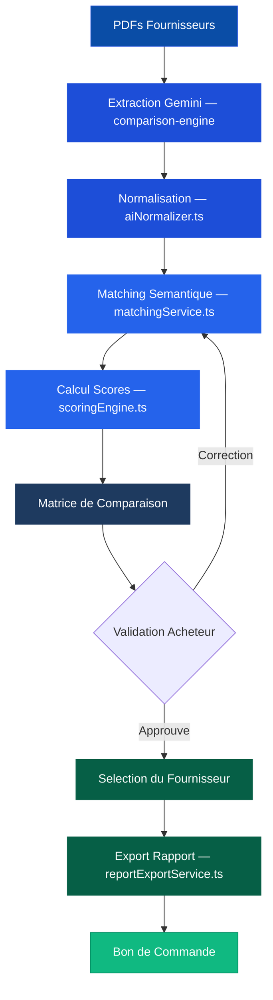

> **FR** — Le Comparateur Offres est le cœur analytique de VesselIQ. Il extrait automatiquement les données des PDFs fournisseurs, applique un scoring IA multicritère et génère des rapports de comparaison exportables.
>
> **EN** — The Offer Comparator is VesselIQ's analytical core. It automatically extracts data from supplier PDFs, applies AI multi-criteria scoring, and generates exportable comparison reports.

---

## Présentation / Overview

Le comparateur combine l'extraction sémantique par **Google Gemini** avec un **moteur de scoring configurable** (`scoringEngine.ts`) pour produire une matrice d'analyse objective et auditée.

*The comparator combines semantic extraction by **Google Gemini** with a **configurable scoring engine** (`scoringEngine.ts`) to produce an objective and audited analysis matrix.*

---

## Grille de notation / Scoring Grid

Le moteur de scoring évalue chaque offre sur deux axes : **Technique** et **Financier**, avec des poids configurables par profil.

*The scoring engine evaluates each offer on two axes: **Technical** and **Financial**, with weights configurable by profile.*

### Critères techniques / Technical Criteria

| Critère | ID | Description FR | Description EN |
|---------|-----|----------------|----------------|
| **Conformité IA** | `aiCompliance` | Score de conformité calculé par Gemini sur 100 | AI compliance score calculated by Gemini out of 100 |
| **Couverture des articles** | `itemCoverage` | `articles couverts / articles demandés` | `covered items / requested items` |
| **Certificat d'origine** | `originCertificate` | Pièces d'origine confirmées (0 ou 1) | Genuine parts confirmed (0 or 1) |
| **Qualité fournisseur** | `supplierQuality` | Score selon le type : Fabricant=100, Représentant exclusif=85, Officiel=70, Revendeur=40 | Score by type: Manufacturer=100, Exclusive Rep=85, Official=70, Reseller=40 |
| **Délai de livraison** | `deliverySpeed` | Inversement proportionnel au nombre de jours | Inversely proportional to delivery days |
| **Historique** | `historicalPerformance` | OTD (On-Time Delivery) et taux de litiges | OTD rate and dispute rate |

### Critères financiers / Financial Criteria

| Critère | ID | Description FR | Description EN |
|---------|-----|----------------|----------------|
| **Compétitivité prix** | `priceCompetitiveness` | `prix le moins-disant / prix offre` | `lowest price / offer price` |
| **Conditions de paiement** | `paymentTerms` | Délais et modes de paiement | Payment terms and methods |
| **Validité de l'offre** | `offerValidity` | Durée de validité de l'offre en jours | Offer validity duration in days |

---

## Profils de scoring / Scoring Profiles

VesselIQ propose **5 profils de scoring** préconfigurés adaptés à chaque situation d'achat. Chaque profil définit les pondérations des axes Technique et Financier ainsi que les critères d'alerte.

*VesselIQ offers **5 preconfigured scoring profiles** adapted to each purchasing situation. Each profile defines Technical/Financial axis weights and alert criteria.*

<AccordionGroup>
  <Accordion title="⚖️ Standard — Équilibré">
    Profil par défaut. Compromis optimal entre performance technique et coût.

    *Default profile. Optimal balance between technical performance and cost.*

    | Axe | Poids |
    |-----|-------|
    | **Technique** | 60% |
    | **Financier** | 40% |

    **Poids techniques :**
    | Critère | Poids |
    |---------|-------|
    | Conformité | 30% |
    | Caractéristiques | 25% |
    | Délai | 20% |
    | Qualité fournisseur | 15% |
    | Historique | 10% |

    **Poids financiers :**
    | Critère | Poids |
    |---------|-------|
    | Montant | 65% |
    | Paiement | 25% |
    | Validité | 10% |

    **Alertes :** Délai max 90 jours · Écart prix max 50% · Score conformité min 50% · Validité min 15 jours
  </Accordion>

  <Accordion title="🚨 Urgence — AOG (Aircraft/Vessel on Ground)">
    Priorité absolue au délai. Utilisé pour les pièces critiques en rupture.

    *Absolute delivery priority. Used for critical out-of-stock parts.*

    | Axe | Poids |
    |-----|-------|
    | **Technique** | 85% |
    | **Financier** | 15% |

    **Spécifique :** Délai max **14 jours** · Pièces d'origine requises · Scoring délai par seuils (≤3j = 100pts, ≤7j = 80pts, ≤14j = 50pts)
  </Accordion>

  <Accordion title="💰 Budget — Optimisation coût">
    Maximise la compétitivité prix. Pour les achats non-critiques.

    *Maximizes price competitiveness. For non-critical purchases.*

    | Axe | Poids |
    |-----|-------|
    | **Technique** | 30% |
    | **Financier** | 70% |

    **Spécifique :** Montant = 80% du financier · Écart prix max 30% · Formule prix **exponentielle** (facteur 15)
  </Accordion>

  <Accordion title="🏆 Qualité Premium">
    Priorité aux certifications et pièces d'origine. Pour les systèmes critiques.

    *Certification and genuine parts priority. For critical systems.*

    | Axe | Poids |
    |-----|-------|
    | **Technique** | 75% |
    | **Financier** | 25% |

    **Spécifique :** Certificat origine = 30% du technique · Score conformité min **80%** · Pièces d'origine obligatoires
  </Accordion>

  <Accordion title="⚙️ Personnalisé / Custom">
    Configurez manuellement les pondérations selon vos besoins spécifiques.

    *Manually configure weights according to your specific needs.*

    | Axe | Poids par défaut |
    |-----|-----------------|
    | **Technique** | 50% |
    | **Financier** | 50% |

    Tous les critères sont modifiables via l'interface. / All criteria are editable via the interface.
  </Accordion>
</AccordionGroup>

---

## Fonctionnalités / Features

<AccordionGroup>
  <Accordion title="Extraction IA des PDFs / AI PDF Extraction">
    **FR** — Gemini Vision analyse automatiquement les PDFs d'offres fournisseurs et extrait : désignations, références, prix unitaires, quantités, délais, conditions de paiement, remarques.

    **EN** — Gemini Vision automatically analyzes supplier offer PDFs and extracts: designations, references, unit prices, quantities, lead times, payment conditions, remarks.

    Fichier : `services/extractionService.ts` · Edge Function : `comparison-engine`
  </Accordion>

  <Accordion title="Matrice multicritère / Multi-criteria Matrix">
    **FR** — La matrice affiche tous les fournisseurs en colonnes et tous les critères en lignes. Les scores sont colorés (vert / orange / rouge) pour une lecture immédiate.

    **EN** — The matrix displays all suppliers as columns and all criteria as rows. Scores are color-coded (green / orange / red) for instant reading.

    Composant : `components/ComparisonMatrix.tsx`
  </Accordion>

  <Accordion title="Matching sémantique / Semantic Matching">
    **FR** — L'IA aligne automatiquement les lignes articles entre les différentes offres même si les désignations sont formulées différemment (ex: "vanne" vs "valve").

    **EN** — AI automatically aligns item lines between different offers even if designations are worded differently (e.g. "vanne" vs "valve").

    Service : `services/matchingService.ts` · Types : `EXACT`, `SEMANTIC`, `PARTIAL`, `NO_MATCH`
  </Accordion>

  <Accordion title="Détection d'anomalies / Anomaly Detection">
    **FR** — Le moteur signale automatiquement les observations critiques (`CriteriaObservation`) : prix trop élevé, délai dépassant le seuil, conformité insuffisante. Ces observations sont des **indicateurs** et n'éliminent pas automatiquement un fournisseur.

    **EN** — The engine automatically flags critical observations (`CriteriaObservation`): price too high, lead time exceeding threshold, insufficient compliance. These observations are **indicators** and do not automatically eliminate a supplier.

    Types d'observations : `critical` · `warning` · `info`
  </Accordion>

  <Accordion title="Validation manuelle / Manual Validation">
    **FR** — L'acheteur valide ou corrige chaque correspondance IA via le panneau de validation (`MatchingValidationPanel`). L'IA apprend des corrections via le `learningService`.

    **EN** — The buyer validates or corrects each AI match via the validation panel (`MatchingValidationPanel`). AI learns from corrections via `learningService`.
  </Accordion>
</AccordionGroup>

---

## Export rapport / Report Export

Le module propose un **export complet du rapport de comparaison** via `components/ReportExportModal.tsx` et `services/reportExportService.ts`.

*The module offers a **complete comparison report export** via `components/ReportExportModal.tsx` and `services/reportExportService.ts`.*

### Contenu du rapport / Report Contents

<Steps>
  <Step title="En-tête / Header">
    Désignation de la consultation, navire concerné, client, date d'analyse, profil de scoring utilisé.

    *Consultation designation, vessel, client, analysis date, scoring profile used.*
  </Step>
  <Step title="Résumé exécutif / Executive Summary">
    Tableau récapitulatif des scores globaux, classement des fournisseurs, fournisseur recommandé mis en évidence.

    *Summary table of global scores, supplier ranking, recommended supplier highlighted.*
  </Step>
  <Step title="Matrice détaillée / Detailed Matrix">
    Grille complète critère par critère avec valeurs brutes et scores normalisés pour chaque fournisseur.

    *Complete criterion-by-criterion grid with raw values and normalized scores for each supplier.*
  </Step>
  <Step title="Observations & alertes / Observations & Alerts">
    Liste des observations critiques, avertissements et informations générés par le moteur d'analyse.

    *List of critical observations, warnings, and informational notes generated by the analysis engine.*
  </Step>
  <Step title="Décision d'achat / Purchase Decision">
    Section de validation avec signature électronique et justification du choix fournisseur.

    *Validation section with electronic signature and supplier choice justification.*
  </Step>
</Steps>

### Formats d'export / Export Formats

| Format | Description FR | Description EN |
|--------|----------------|----------------|
| **PDF** | Rapport formaté avec en-têtes et logos | Formatted report with headers and logos |
| **Excel** | Données brutes + scores pour analyse complémentaire | Raw data + scores for further analysis |
| **Impression** | Vue optimisée pour impression (`PrintDialog.tsx`) | Print-optimized view |

<Tip>
Le rapport PDF est généré via `services/printService.ts` et peut être directement attaché à un dossier de consultation pour archivage.

*The PDF report is generated via `services/printService.ts` and can be directly attached to a consultation dossier for archiving.*
</Tip>

---

## Logique du flux / Workflow Logic

<Tip>
Utilisez les boutons **+** / **−** en bas à droite du schéma pour zoomer, ou **↺** pour réinitialiser la vue.

*Use the **+** / **−** buttons at the bottom-right of the diagram to zoom, or **↺** to reset the view.*
</Tip>

---

## Dépannage / Troubleshooting

<AccordionGroup>
  <Accordion title="L'extraction PDF échoue / PDF extraction fails">
    **FR** — Vérifiez que la clé `GEMINI_API_KEY` est configurée dans les secrets de l'Edge Function `comparison-engine`. Assurez-vous que les PDFs ne sont pas protégés par mot de passe.

    **EN** — Check that `GEMINI_API_KEY` is configured in the `comparison-engine` Edge Function secrets. Ensure PDFs are not password-protected.
  </Accordion>

  <Accordion title="Scores inattendus / Unexpected scores">
    **FR** — Vérifiez le profil de scoring sélectionné. Chaque profil a des pondérations très différentes. Le profil « Urgence » par exemple donne 85% du poids à l'axe technique avec une priorité délai.

    **EN** — Check the selected scoring profile. Each profile has very different weights. The « Urgence » profile for example gives 85% weight to the technical axis with delivery priority.
  </Accordion>

  <Accordion title="Matching incorrects / Incorrect matches">
    **FR** — Utilisez le panneau de validation manuelle pour corriger les correspondances. VesselIQ enregistre vos corrections via le `learningService` pour améliorer les matchings futurs.

    **EN** — Use the manual validation panel to correct matches. VesselIQ records your corrections via `learningService` to improve future matchings.
  </Accordion>
</AccordionGroup>
