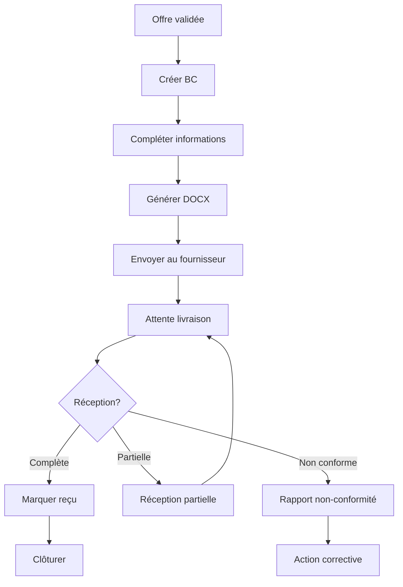

## Présentation / Overview

Le module **Bons de Commande** (BC) permet de générer, gérer et suivre les commandes émises suite aux consultations. Il s'intègre avec le comparateur d'offres pour transformer l'offre retenue en bon de commande officiel, et supporte la génération automatique de documents DOCX.

*The **Purchase Orders** module lets you generate, manage, and track orders issued from consultations. It integrates with the offer comparator to transform the selected offer into an official purchase order, with automatic DOCX document generation.*

<Frame caption="Génération PDF/Word et création d'un nouveau bon de commande.">
  
</Frame>

---

## Cycle de vie / Lifecycle

| Statut | Description FR | Description EN |
|--------|---------------|----------------|
| **draft** | Brouillon en cours d'édition | Draft being edited |
| **validation_pending** | En attente de validation | Pending validation |
| **sent** | Envoyé au fournisseur | Sent to supplier |
| **partial_receipt** | Réception partielle | Partial receipt |
| **received** | Réceptionné complet | Fully received |
| **cancelled** | Annulé | Cancelled |

---

## Fonctionnalités / Features

### 1. Création de bon de commande / Creating a PO

<Steps>
  <Step title="Depuis le comparateur / From the comparator">
    Après validation de l'offre retenue dans le comparateur, cliquez **"Générer BC"** pour pré-remplir automatiquement :
    - Référence fournisseur et ID consultation
    - Liste des articles avec prix validés
    - Conditions de paiement et incoterm
    - Montant total et devise
  </Step>
  <Step title="Saisie complémentaire / Additional data entry">
    Complétez les informations :
    - **Objet** du BC
    - **Date prévue de livraison**
    - **Conditions de paiement** détaillées
    - **Incoterm** (FOB, CIF, EXW, etc.)
    - **Pièces jointes** : facture proforma, documents techniques
  </Step>
  <Step title="Génération DOCX / DOCX Generation">
    Générez automatiquement un document Word à partir des **templates DOCX** configurés :
    - **BC standard** : bon de commande classique
    - **PDR template** : format pièces de rechange
    - **Service template** : format prestation de service

    Les variables sont automatiquement remplacées : `{{REFERENCE}}`, `{{FOURNISSEUR}}`, `{{MONTANT}}`, `{{DATE}}`, etc.
  </Step>
</Steps>

### 2. Suivi des commandes / Order Tracking

<AccordionGroup>
  <Accordion title="Vue liste / List View">
    Tableau avec colonnes : référence, fournisseur, montant, devise, statut, date livraison prévue, conformité.
  </Accordion>
  <Accordion title="Réception / Receipt">
    À la réception des marchandises :
    - Marquez la commande comme **réceptionnée** (totale ou partielle)
    - Renseignez la **date de réception réelle**
    - Évaluez la **conformité PDR** : conforme, non conforme, ou partielle
    
    *On receipt: mark order as received (full or partial), enter actual receipt date, evaluate PDR compliance.*
  </Accordion>
  <Accordion title="Non-conformité / Non-conformity">
    En cas de non-conformité, détaillez :
    - **Type** : mauvaise référence, quantité incorrecte, qualité insuffisante, emballage endommagé, documentation manquante
    - **Description** détaillée
    - **Quantité affectée**
    - **Sévérité** : critique, warning, info
    
    *On non-conformity: specify type, description, affected quantity, and severity.*
  </Accordion>
</AccordionGroup>

### 3. Statistiques financières / Financial Statistics

Le module affiche des indicateurs financiers :
- Montant total des commandes par période
- Répartition par fournisseur et par devise
- Taux de conformité PDR global
- Délai moyen de livraison vs prévu

---

## Logique du flux / Workflow Logic

---

## Avantages / Benefits

<Tip>
  Les **templates DOCX personnalisables** permettent de générer des bons de commande au format exactement conforme à vos standards d'entreprise.
  
  *Customizable **DOCX templates** let you generate purchase orders in your company's exact standard format.*
</Tip>

---

## Dépannage / Troubleshooting

<AccordionGroup>
  <Accordion title="Le DOCX généré est vide / Generated DOCX is empty">
    Vérifiez que les templates sont correctement configurés dans Gestion Données > Templates DOCX. Les variables doivent respecter le format `{{VARIABLE}}`.
    
    *Check that templates are properly configured in Data Management > DOCX Templates. Variables must use the `{{VARIABLE}}` format.*
  </Accordion>
</AccordionGroup>
