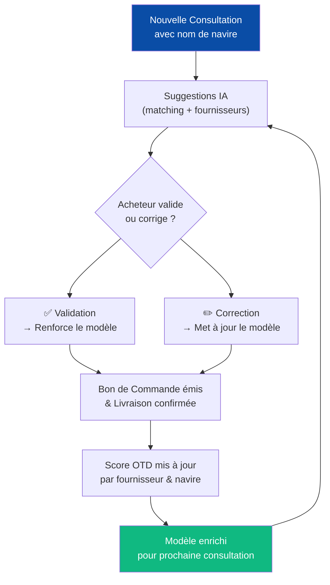
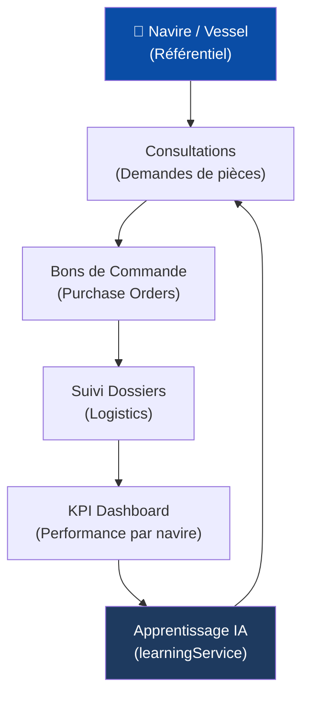

> **FR** — Gérez l'intégralité de votre flotte maritime. Chaque navire dispose d'une fiche technique détaillée, d'un planning de maintenance et d'un historique d'approvisionnement. Le module est enrichi par l'**apprentissage automatique** pour améliorer les suggestions de fournisseurs et de pièces au fil du temps.
>
> **EN** — Manage your entire maritime fleet. Each vessel has a detailed technical profile, maintenance scheduling, and procurement history. The module is enhanced by **machine learning** to improve supplier and parts suggestions over time.

---

## Fonctionnalités / Features

### 1. Fiche navire / Vessel Profile

| Champ | Description FR | Description EN |
|-------|----------------|----------------|
| **Nom** | Nom du navire | Vessel name |
| **IMO** | Numéro IMO unique (7 chiffres) | Unique IMO number |
| **Port d'attache** | Port d'immatriculation | Port of registry |
| **Type** | Cargo, Tanker, Bulk, Container, Offshore... | Vessel type |
| **Pavillon** | État du pavillon avec drapeau visuel | Flag state with visual flag |
| **Année de construction** | Year built |  |
| **Statut** | En service / En cale sèche / Désarmé | In service / Dry dock / Laid up |

### 2. Spécifications techniques / Technical Specifications

- **Puissance** moteur (kW) — Main engine power
- **Tonnage** (DWT) — Deadweight tonnage
- **Longueur / Largeur / Tirant d'eau** — LOA / Beam / Draft
- **Équipage** minimum — Minimum crew
- **Compartiments** configurables — Configurable compartments

### 3. Planification maintenance / Maintenance Planning

- **Dernière maintenance** avec date et type d'intervention
- **Prochaine maintenance** calculée automatiquement selon l'intervalle défini
- **Intervalle** de maintenance configurable (en jours)
- **Alertes** automatiques avant échéance

### 4. Cartes visuelles / Visual Cards

Les navires s'affichent en **cartes visuelles** (`ShipCard.tsx`) avec :
- Icône de type de navire
- Drapeau du pavillon
- Indicateur de statut en couleur
- Statistiques rapides (consultations associées)

---

## Apprentissage automatique / Machine Learning

<Note>
Le module Navires est connecté au **système d'apprentissage automatique** de VesselIQ (`learningService.ts`). Plus vous utilisez la plateforme pour un navire donné, plus les suggestions deviennent précises.

*The Ships module is connected to VesselIQ's **machine learning system** (`learningService.ts`). The more you use the platform for a given vessel, the more precise the suggestions become.*
</Note>

### Ce que VesselIQ apprend / What VesselIQ learns

<AccordionGroup>
  <Accordion title="Correspondances articles / Part Matching">
    **FR** — L'IA mémorise les correspondances validées entre désignations de pièces et références fournisseurs pour chaque navire. Lors d'une nouvelle consultation sur le même navire, ces correspondances sont proposées en priorité.

    **EN** — AI memorizes validated matches between part designations and supplier references for each vessel. When a new consultation is created for the same vessel, these matches are suggested first.

    Fichier : `services/learningService.ts` · Config : `config/learningConfig.ts`
  </Accordion>

  <Accordion title="Fournisseurs préférés par navire / Preferred Suppliers per Vessel">
    **FR** — VesselIQ analyse l'historique des bons de commande pour identifier les fournisseurs les plus performants pour chaque type de navire et chaque catégorie de pièces (moteur, hydraulique, électrique...).

    **EN** — VesselIQ analyzes purchase order history to identify the best-performing suppliers for each vessel type and parts category (engine, hydraulic, electrical...).
  </Accordion>

  <Accordion title="Délais de livraison / Delivery Lead Times">
    **FR** — Après chaque réception confirmée dans le suivi dossier, l'IA met à jour ses modèles de prédiction de délais par fournisseur et par route maritime (ex: Asie → Algérie).

    **EN** — After each confirmed reception in dossier tracking, AI updates its delivery time prediction models by supplier and maritime route (e.g., Asia → Algeria).
  </Accordion>

  <Accordion title="Profils de scoring adaptatifs / Adaptive Scoring Profiles">
    **FR** — Le moteur de scoring `scoringEngine.ts` ajuste ses pondérations en fonction des retours terrain : si un fournisseur livre systématiquement en retard pour ce navire, son score délai est automatiquement pénalisé lors des prochaines analyses.

    **EN** — The `scoringEngine.ts` scoring engine adjusts its weights based on field feedback: if a supplier consistently delivers late for this vessel, their delivery score is automatically penalized in future analyses.
  </Accordion>
</AccordionGroup>

### Cycle d'apprentissage / Learning Cycle

---

## Logique du flux / Workflow Logic

Les navires sont **référencés** dans les consultations, les bons de commande et le suivi des dossiers. Chaque pièce commandée est tracée vers le navire destinataire, alimentant les KPIs par navire.

*Vessels are **referenced** in consultations, purchase orders, and dossier tracking. Each ordered part is traced to the destination vessel, feeding per-vessel KPIs.*

---

## Avantages / Benefits

<Tip>
**Traçabilité complète** — Toutes les pièces commandées sont associées à un navire, permettant un historique d'approvisionnement précis et des audits simplifiés.

*Complete traceability — All ordered parts are linked to a vessel, enabling precise procurement history and simplified audits.*
</Tip>

<Tip>
**Amélioration continue** — L'apprentissage automatique améliore les suggestions de fournisseurs et la précision des délais au fil des transactions.

*Continuous improvement — Machine learning improves supplier suggestions and lead time accuracy with each transaction.*
</Tip>
