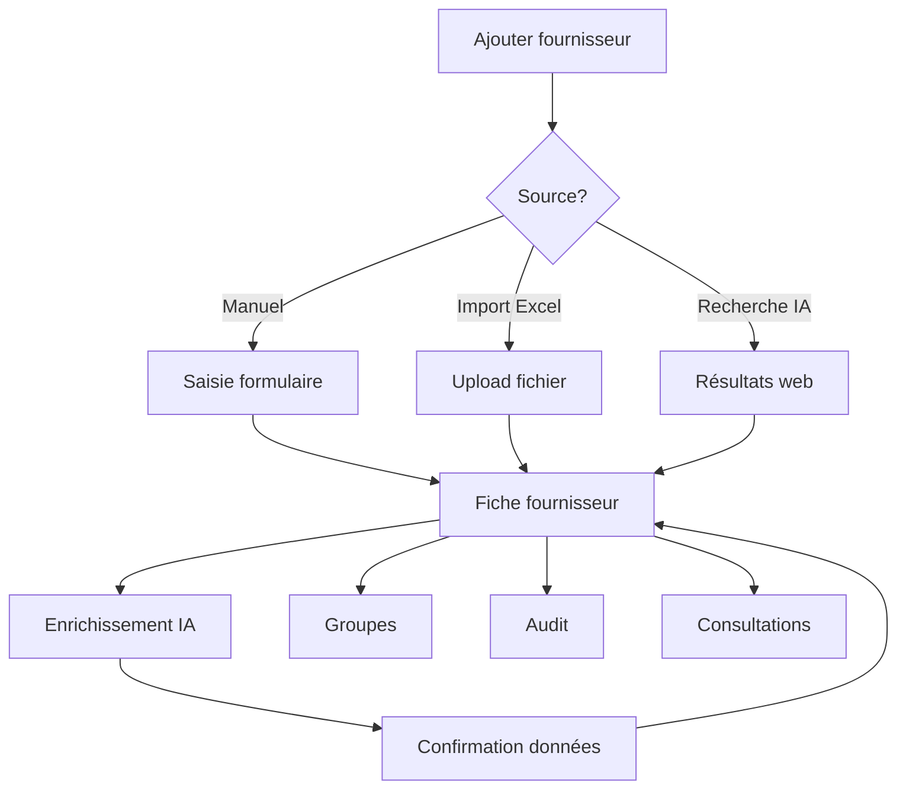

## Présentation / Overview

Le module **Gestion Fournisseurs** centralise toute l'information relative à vos partenaires commerciaux : coordonnées, spécialités, certifications, historique de performance, et enrichissement automatique via l'intelligence artificielle.

*The **Supplier Management** module centralizes all information about your business partners: contact details, specialties, certifications, performance history, and automatic enrichment via artificial intelligence.*

<Frame caption="Base de données unifiée pour la gestion des profils fournisseurs.">
  
</Frame>

---

## Fonctionnalités / Features

### 1. Fiche fournisseur / Supplier Profile

Chaque fournisseur dispose d'une fiche complète :

| Champ | Description |
|-------|-------------|
| **Nom** | Raison sociale |
| **Email** | Email principal |
| **Téléphone / Fax** | Coordonnées |
| **Site web** | URL du site |
| **Adresse** | Rue, ville, code postal, pays |
| **Type** | OEM, Distributeur, Agent, etc. |
| **Catégorie** | Marine, Industriel, Électrique, etc. |
| **Marque** | Marques représentées |
| **Spécialités** | Domaines d'expertise (liste) |
| **Certifications** | ISO, Lloyd's, DNV, etc. |
| **Conditions de paiement** | Termes standard |
| **Devise** | Devise préférentielle |
| **Délai de livraison** | Délai standard |
| **Rating** | Note de performance (1-5) |
| **Statut** | Actif / Inactif |
| **Notes** | Notes internes |
| **Notes IA** | Notes générées par l'enrichissement IA |

### 2. Enrichissement IA / AI Enrichment

<Steps>
  <Step title="Enrichissement individuel / Individual Enrichment">
    Cliquez sur **"Enrichir via IA"** pour qu'un agent IA recherche automatiquement :
    - Les coordonnées manquantes
    - Les spécialités et certifications
    - L'historique d'entreprise
    - Les avis et réputations
    
    *Click **"Enrich via AI"** to have an AI agent automatically search for: missing contact info, specialties, certifications, company history, reviews.*
  </Step>
  <Step title="Enrichissement en masse / Bulk Enrichment">
    Sélectionnez plusieurs fournisseurs et lancez l'enrichissement global. Un indicateur de progression affiche l'avancement en temps réel.
    
    *Select multiple suppliers and launch global enrichment. A progress indicator shows real-time advancement.*
  </Step>
  <Step title="Confirmation / Confirmation">
    Avant d'appliquer les données IA, un modal de confirmation affiche les changements proposés. Vous pouvez accepter ou rejeter chaque modification.
    
    *Before applying AI data, a confirmation modal shows proposed changes. You can accept or reject each modification.*
  </Step>
</Steps>

### 3. Groupes fournisseurs / Supplier Groups

Organisez vos fournisseurs en **groupes** pour :
- Consulter un groupe entier en un clic
- Gérer les fournisseurs par catégorie métier
- Créer des groupes géographiques ou par spécialité

Actions possibles : créer un groupe, renommer, ajouter/retirer des fournisseurs, supprimer un groupe.

*Organize suppliers into **groups** for: one-click group consultations, business category management, geographic or specialty groups.*

### 4. Import Excel / Excel Import

Importez massivement des fournisseurs depuis un fichier Excel :
- Template téléchargeable fourni (`suppliers-import.xlsx`)
- Colonnes : nom, email, téléphone, pays, type, catégorie, spécialités
- Détection automatique des doublons
- Validation des données avant import

*Bulk import suppliers from Excel: downloadable template, auto-duplicate detection, data validation.*

### 5. Audit fournisseur / Supplier Audit

Le module d'audit analyse automatiquement :
- **Complétude du profil** — pourcentage de champs remplis
- **Qualité des données** — emails valides, téléphones formatés
- **Performance historique** — taux de réponse, délais, conformité
- **Analyse de risque** — scoring de fiabilité avec facteurs de risque
- **Recommandations** — actions suggérées pour améliorer le profil

*The audit module auto-analyzes: profile completeness, data quality, historical performance, risk assessment, and recommended actions.*

### 6. Vue tableau et filtres / Table View & Filters

Filtrez la base fournisseurs par :
- Pays (avec drapeau pays)
- Catégorie et type
- Statut (actif/inactif)
- Rating minimum
- Recherche texte libre

*Filter by country (with flags), category, type, status, minimum rating, free text search.*

---

## Logique du flux / Workflow Logic

---

## Avantages / Benefits

<Tip>
  L'**enrichissement IA** transforme une base fournisseurs minimale en un référentiel complet sans effort manuel.
  
  ***AI enrichment** transforms a minimal supplier database into a complete reference without manual effort.*
</Tip>

<Tip>
  L'**audit automatique** identifie les fournisseurs avec données obsolètes ou incomplètes, garantissant la qualité du référentiel.
  
  ***Automatic audit** identifies suppliers with outdated or incomplete data, ensuring reference quality.*
</Tip>

---

## Dépannage / Troubleshooting

<AccordionGroup>
  <Accordion title="L'import Excel échoue / Excel import fails">
    Utilisez le template officiel. Vérifiez que les colonnes correspondent au format attendu. Les doublons sur le nom ou l'email sont automatiquement signalés.
    
    *Use the official template. Check that columns match the expected format. Duplicates on name or email are automatically flagged.*
  </Accordion>
  <Accordion title="L'enrichissement IA retourne des données incorrectes / AI enrichment returns incorrect data">
    L'IA peut parfois confondre des entreprises homonymes. Vérifiez toujours les données proposées avant validation, surtout pour les coordonnées.
    
    *AI may sometimes confuse same-name companies. Always review proposed data before validation, especially contact info.*
  </Accordion>
</AccordionGroup>
